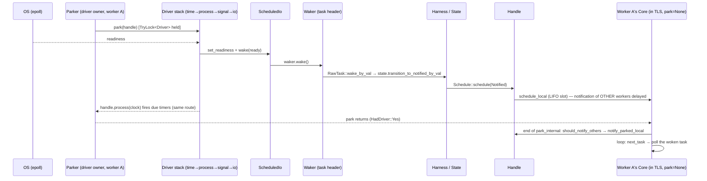
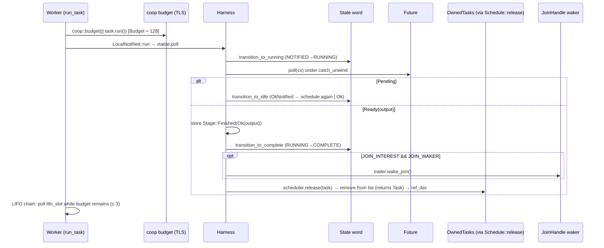
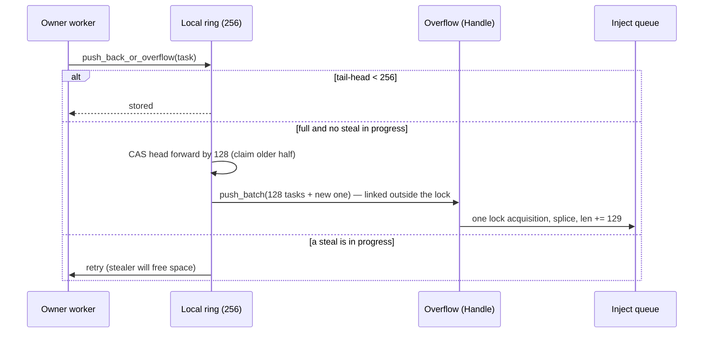
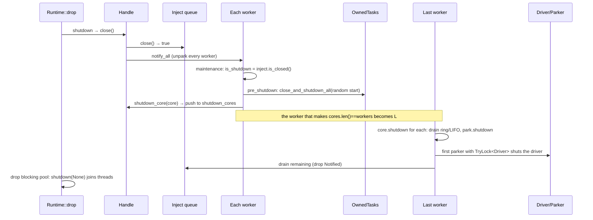

# How the modules talk to each other

Two views: a **who-calls-whom matrix** (static) and **sequence diagrams** of the eight important runtime conversations (dynamic).
Every arrow is backed by a call site in the source; the page that proves it is linked at each step.

Module abbreviations: **RT** = `Runtime`/`Handle`/`Builder` · **CTX** = thread-local context · **SCH** = scheduler (current-thread or multi-thread) ·
**WRK** = worker loop · **LQ** = local ring queue · **INJ** = inject queue · **IDL** = Idle · **PRK** = Parker · **DRV** = driver stack ·
**TSK** = task module (Harness/RawTask/State) · **OWN** = `OwnedTasks` · **WKR** = Waker · **JH** = JoinHandle · **BLK** = blocking pool · **COOP** = budget · **DEF** = Defer · **MET** = stats/metrics.

---

## 1. Static call matrix (row calls column)

| ↓ calls → | TSK | OWN | SCH/WRK | LQ | INJ | IDL | PRK | DRV | CTX | BLK | COOP | DEF | MET |
|---|---|---|---|---|---|---|---|---|---|---|---|---|---|
| **RT** (`spawn`, `block_on`, drop) | `new_task` via OWN | `bind` | `spawn`, `shutdown` | | | | | `Driver::new` | `enter_runtime`, `set_current` | build pool | | | |
| **CTX** | | | stores `scheduler::Context` | | | | | | – | | `Budget` cell | | |
| **WRK** | `LocalNotified::run` | `assert_owner`, `close_and_shutdown_all` | – | `pop/push/steal` | `pop_n`, `close` | all transitions | `park*` | – | `set_scheduler`, `enter_runtime` | `spawn_blocking(run)` | `coop::budget` | `wake` | `Stats` |
| **LQ** | `RawTask` ptrs | | | – | via `Overflow` | | | | | | | | `Stats` |
| **INJ** | `queue_next` via RawTask | | | | – | | | | | | | | |
| **IDL** | | | reads `Shared.synced` | | | – | | | | | | | |
| **PRK** | | | | | | | – | `park/unpark/shutdown` | | | | | |
| **DRV** | → `Waker::wake` (via `ScheduledIo`, timer wheel) | | | | | | | – | | | | | |
| **TSK** | – | `remove` (via `Schedule::release`) | **`Schedule::schedule/release/yield_now/hooks`** | | | | | | | | | | |
| **WKR** | `RawTask::wake_by_val/ref` → `Schedule::schedule` | | (via TSK) | | | | | | | | | | |
| **JH** | `try_read_output`, `drop_join_handle`, `State` | | | | | | | | | | `poll_proceed` in `poll` | | |
| **resources** (`TcpStream`, `Sleep`, channels) | – | – | – | – | – | – | – | register via `Handle` | `Handle::current` | `spawn_blocking` | `poll_proceed` | `defer` (budget exhausted / `yield_now`) | |

Reading the matrix:

* **TSK never calls SCH/WRK/LQ/INJ directly** — only the trait `Schedule` (and `Overflow` is used by LQ, never by TSK). That is the layering rule.
* **LQ and INJ never call IDL/PRK**: waking is the *caller's* job (`Handle::schedule_*` → `notify_parked_*`). Data structures stay pure.
* **DRV never touches queues**: it only calls `Waker::wake`, which re-enters the TSK → SCH path.
* **CTX is the glue** that lets code with no handle in hand (a waker called from the driver, `tokio::spawn`, `coop::poll_proceed`) find the current scheduler/budget.

---

## 2. Sequences

### S1 — `tokio::spawn` from **inside** a worker (the hot path)

```mermaid
sequenceDiagram
    participant U as User task (running on worker W)
    participant CTX as Thread-local CONTEXT
    participant H as multi_thread::Handle
    participant OWN as OwnedTasks
    participant TSK as task::new_task
    participant LQ as W's LIFO slot / ring
    participant IDL as Idle
    participant PRK as Parker of another worker
    U->>CTX: spawn() → current handle
    CTX->>H: Handle::spawn(future, id)
    H->>OWN: bind(future, Arc<Handle>, id)
    OWN->>TSK: new_task → (Task, Notified, JoinHandle) [3 refs]
    OWN->>OWN: lock shard · closed? · push(Task)
    OWN-->>H: (JoinHandle, Some(Notified))
    H->>H: schedule_option_task_without_yield → schedule_task(n, false)
    H->>CTX: with_current → is this my runtime and do I hold a Core?
    H->>LQ: schedule_local: displace LIFO slot → push_back_or_overflow(prev); slot = new
    H->>IDL: (if Core.park is Some) notify_parked_local → worker_to_notify
    IDL-->>PRK: Unparker::unpark (condvar or driver.unpark)
    H-->>U: JoinHandle
```
Proof pages: [sched/04](./scheduler/04-multithread-state-and-spawn.md), [task/08](./task/08-owned-tasks.md), [sched/05](./scheduler/05-worker-loop.md) §schedule_local, [sched/08](./scheduler/08-idle-coordination.md).

### S2 — `rt.spawn` / wake from a **foreign thread** (inject path)

```mermaid
sequenceDiagram
    participant X as Foreign thread
    participant H as Handle (via schedule_task)
    participant INJ as Inject queue (Mutex)
    participant IDL as Idle
    participant PRK as Parker (sleeper)
    participant W as Worker
    X->>H: schedule_task(Notified)
    H->>H: with_current → no matching Core → remote
    H->>INJ: push_remote_task: lock · link via queue_next · len.store(Release)
    H->>IDL: notify_parked_remote → worker_to_notify (SeqCst RMW; skip if someone is searching)
    IDL-->>PRK: unpark
    PRK-->>W: park returns
    W->>W: transition_from_parked → searching
    W->>INJ: next_task: pop_n(len/workers+1) (lock held while copying into ring)
    W->>W: run_task (leaves searching; may wake another)
```
Proof pages: [sched/07](./scheduler/07-inject-queue.md), [sched/08](./scheduler/08-idle-coordination.md), [sched/09](./scheduler/09-parker.md).

### S3 — I/O event → task runs (driver thread ≠ task's worker)


Proof pages: [sched/13](./scheduler/13-driver-interface.md) §4, [task/06](./task/06-waker.md), [sched/09](./scheduler/09-parker.md).

### S4 — one poll, completion, and `JoinHandle` wake-up


Proof pages: [task/04](./task/04-harness.md), [task/01](./task/01-state-word.md), [task/10](./task/10-coop-budget.md), [sched/05](./scheduler/05-worker-loop.md).

### S5 — work stealing

```mermaid
sequenceDiagram
    participant T as Thief worker (empty)
    participant IDL as Idle
    participant V as Victim's Remote.steal
    participant VQ as Victim ring (SPMC)
    participant TQ as Thief ring
    T->>IDL: transition_worker_to_searching (≤ half of workers may search)
    T->>V: pick start index via FastRand; for each other worker
    T->>VQ: steal_into(dst, stats): CAS head (steal<<32|real) → "stealing" state
    VQ-->>T: n = (len - len/2) tasks copied (first returned, rest into TQ)
    T->>VQ: second CAS: head = (real', real') — steal finished
    T->>IDL: (on run_task) transition_from_searching → if last searcher: notify another
```
Proof pages: [sched/06](./scheduler/06-local-queue.md) §steal, [sched/05](./scheduler/05-worker-loop.md) §steal_work, [sched/08](./scheduler/08-idle-coordination.md).

### S6 — ring overflow → inject


Proof pages: [sched/06](./scheduler/06-local-queue.md) §push_overflow, [sched/07](./scheduler/07-inject-queue.md) §push_batch.

### S7 — `block_in_place`

```mermaid
sequenceDiagram
    participant T1 as Thread 1 (task calling block_in_place)
    participant WK as Worker.core (AtomicCell)
    participant BLK as Blocking pool
    participant T2 as Thread 2
    T1->>T1: defer.wake(); move LIFO task to ring
    T1->>WK: core.set(Box<Core>)
    T1->>BLK: spawn_blocking(run(worker))
    BLK-->>T2: start
    T2->>WK: core.take() → Some(core) → run loop
    T1->>T1: exit_runtime(f) — blocks; budget suspended
    T1->>WK: Reset::drop: core.take() → maybe None
    Note over T1,T2: Some → T1 resumes as worker · None → T1 finishes poll without core, run_task returns Break
```
Proof page: [sched/11](./scheduler/11-block-in-place-and-defer.md).

### S8 — shutdown


Proof page: [sched/12](./scheduler/12-shutdown.md).

---

## 3. Synchronisation primitives used at each boundary

| Boundary | Mechanism | Why this one |
|---|---|---|
| waker → task state | CAS loop on `State` (`AtomicUsize`), `AcqRel`/`Acquire` | many wakers race with poll/abort/drop |
| TSK → LQ/INJ | ownership of `Notified` (move) | no sharing, no locks |
| owner ↔ stealers | packed `(steal,real)` head CAS + `Release`/`Acquire` tail | wait-free owner push, lock-free steal |
| any thread → INJ | `Mutex<Synced>` + `AtomicUsize len` (Release store, Acquire load) | simple, unbounded; len avoids the lock when empty |
| notifier ↔ sleeper | packed `Idle.state` + `SeqCst`, `Mutex` around `sleepers` | Dekker-style park/notify handshake |
| sleeper ↔ waker | `Parker.state` swap/CAS `SeqCst` + condvar or mio waker | no lost wake-ups |
| core hand-off | `AtomicCell<Core>` (pointer swap) | single owner, no lock |
| TLS access | `Scoped<T>` cell + `Cell`/`RefCell` | no atomics; set/unset by RAII guards |
| metrics | local `u64` batch → `Relaxed` stores | zero contention |
| shutdown cores | `Mutex<Vec<Box<Core>>>` | rare, needs "last one wins" counting |
